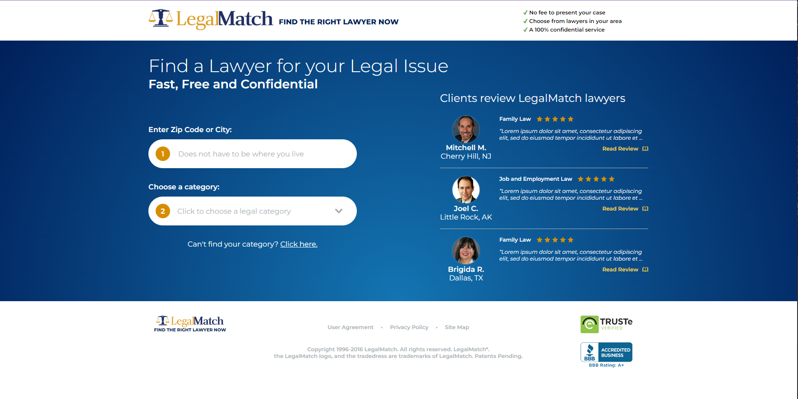

# Technical Onboarding Exam - Replicated Webpage
This is for technical exam purposes and will be set to private once exam is done to avoid replication. 

# View website of project
Website Link: 
https://odenlerma.github.io/replicated-website-design/

# 


# Instructions


## Step 1: First clone this repository

```bash
git clone https://github.com/odenlerma/replicated-website-design.git
```


## Step 2: Install dependencies

Go to folder and run the following commands:
```bash
npm install
```

This projects *gulp* for SASS compiler. If you do not have cli installed, run the commands below:
```bash
npm install --global gulp-cli
```
Refer to [gulp](https://gulpjs.com/docs/en/getting-started/quick-start/) for more detailed documentation on setting up Gulp.

To compile SASS into css, run the following code:
```bash
gulp
```

## Step 3: Run Website
This project uses "live-server" to run website to avoid CORS Error but if you have preferred ways to run it feel free to do so.


# License:
The MIT License (MIT)

Copyright (c) 2024 odenlerma

Permission is hereby granted, free of charge, to any person obtaining a copy
of this software and associated documentation files (the "Software"), to deal
in the Software without restriction, including without limitation the rights
to use, copy, modify, merge, publish, distribute, sublicense, and/or sell
copies of the Software, and to permit persons to whom the Software is
furnished to do so, subject to the following conditions:

The above copyright notice and this permission notice shall be included in all
copies or substantial portions of the Software.

THE SOFTWARE IS PROVIDED "AS IS", WITHOUT WARRANTY OF ANY KIND, EXPRESS OR
IMPLIED, INCLUDING BUT NOT LIMITED TO THE WARRANTIES OF MERCHANTABILITY,
FITNESS FOR A PARTICULAR PURPOSE AND NONINFRINGEMENT. IN NO EVENT SHALL THE
AUTHORS OR COPYRIGHT HOLDERS BE LIABLE FOR ANY CLAIM, DAMAGES OR OTHER
LIABILITY, WHETHER IN AN ACTION OF CONTRACT, TORT OR OTHERWISE, ARISING FROM,
OUT OF OR IN CONNECTION WITH THE SOFTWARE OR THE USE OR OTHER DEALINGS IN THE
SOFTWARE.

